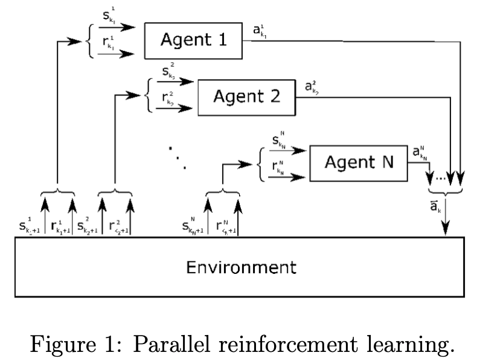
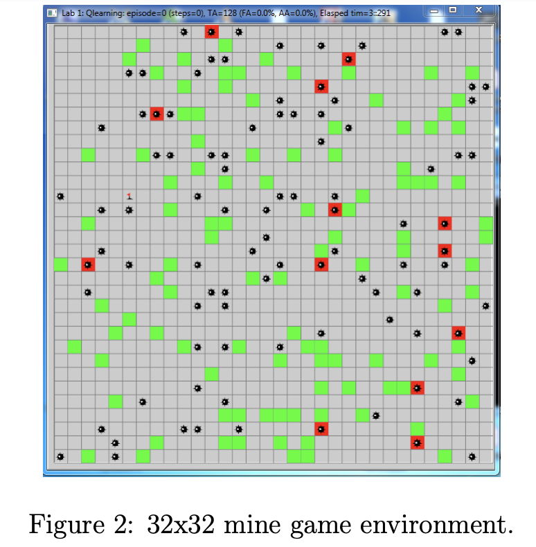

# Asynchronous Multi-agent Q(&lambda;) Learning
This repo contains a C++/CUDA implementation of parallel Q(&lambda;) Learning, which is an extension of Q-learning (referred to as Q(0) learning), and is an implementation of Watson's Q(&lambda;) Learning found in Sutton and Barto's [reinforcement learning book](http://www.incompleteideas.net/book/the-book-2nd.html). The implementation however is different due to taking advantage of the GPUs to achieve parallelism for asynchronous learning of the algorithm.
 
 
## Environment
The environment consists of a 32x32 grid and 128 agents that try to reach one flag. There are also 96 mines that if stepped on by agents will terminate their chances. 
 
 
The goal is to learn a successful path to the flag for all states on the grid. 

## Demo
[Q-learning Demo](https://www.youtube.com/watch?v=XxnJLYPveT4&ab_channel=JawnHo).
 
[Q(&lambda;) Learning demo and presesntation](https://www.youtube.com/watch?v=XxnJLYPveT4&ab_channel=JawnHo).

    
     
    

